# PJ1 — MNIST Digit Recognition with a NumPy Neural Network

> 课程：神经网络与深度学习
> PJ1 — Build an MLP / CNN framework with NumPy
> 姓名：严瑞琪　　学号：22300680293
> 日期：2026-05-16
>
> Code (GitHub): https://github.com/RuiXueChuJi/Neural-Network-and-Deep-Learning
> Trained weights (ModelScope): https://www.modelscope.cn/models/RuiXueChuJi/NN-DL-HW2/summary

<p align="center">
  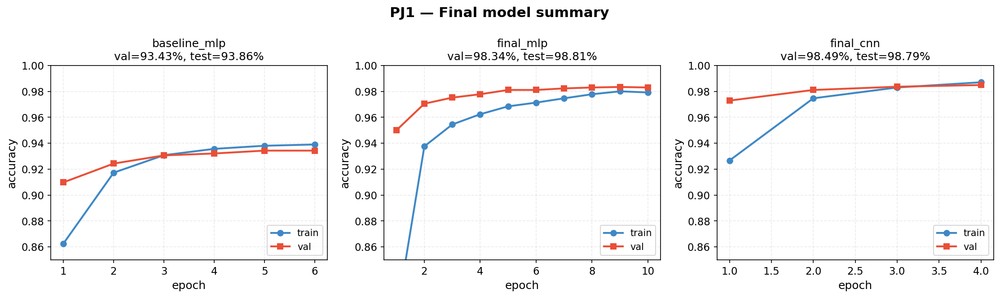
</p>

This report follows the six sections required by Appendix A.6 of the project handout:

1. **MLP baseline** — §1
2. **CNN model and MLP-vs-CNN comparison** — §2
3. **Two additional directions** — §3
4. **Main results table** — §4
5. **Detailed visualization** — §5
6. **Discussion** — §6

A self-contained appendix (§A) describes the NumPy framework, layer math,
optimizer/scheduler implementations, reproduction commands, and references.

The two additional directions we chose (cf. §3) are
**Direction 1 — Optimization** and **Direction 2 — Regularization**.
The project handout's "Direction 5 — Error Analysis & Visualization" is
satisfied by §5 (weight, kernel, and confusion-matrix visualizations).

---

## 0. Summary

| Model | Optimizer | Schedule | Regularization | Best Val Acc | **Test Acc** |
|---|---|---|---|---:|---:|
| Baseline MLP `[784, 600, 10]` | SGD lr=0.06 | MultiStepLR | — | 93.43% | **93.86%** |
| **Final MLP** `[784, 512, 256, 10]` | AdamW lr=1e-3 | warmup + cosine | dropout 0.2 + WD 1e-4 + light aug | 98.34% | **98.81%** |
| **Final CNN** `Conv8→Conv16→FC128→10` | AdamW lr=1e-3 | cosine | dropout 0.2 + WD 1e-4 | 98.49% | **98.79%** |

For a fair MLP-vs-CNN comparison under matched training settings, see §2.2.

---

## 1. MLP Baseline

> Covers Part A of the handout (§1.2): forward/backward of a linear layer,
> softmax cross-entropy, MLP training, train/val performance, and a learning
> curve.

### 1.1 Problem setting

- **Task**: 10-class classification on MNIST.
- **Data**: 60 000 training + 10 000 test images (28 × 28, grayscale).
- We split the 60 000 training images into **50 000 train** / **10 000 val**.
- Pixels are normalized to `[0, 1]`.

### 1.2 What we implemented for the baseline

The required core operators live in [PJ1/codes/mynn/op.py](../PJ1/codes/mynn/op.py):

- `Linear.forward / Linear.backward` — fully implemented from scratch
  (math in §A.2.1);
- `MultiCrossEntropyLoss` — numerically stable softmax + cross-entropy in one
  operator using the log-sum-exp trick (math in §A.2.3).

Both layers were verified against finite-difference gradients to within
`1e-9` (see §A.2.2 for the same check on `conv2D`).

### 1.3 Baseline training setting

| Item | Value |
|---|---|
| Architecture | `Linear 784→600 → ReLU → Linear 600→10` |
| Optimizer | SGD, lr = 0.06 |
| LR schedule | MultiStepLR, decay ×0.1 at the late milestones |
| Batch size | 32 |
| Epochs | 5 |
| Augmentation | none |
| Initialization | `Normal(0, 0.01)` |

This is the simplest configuration that closes the loop end-to-end (Linear +
softmax-CE + SGD + LR step) — exactly the spirit of A.4's "finish Linear and
MultiCrossEntropyLoss, then run and verify your MLP baseline".

### 1.4 Baseline learning curve and result

The baseline MLP reaches **best val 93.43%** and **test 93.86%**. The
learning curve below (loss + train/val accuracy per epoch) shows the model
converging cleanly without instability — confirming that forward, backward,
softmax-CE, and the SGD update are all wired up correctly.

<p align="center">
  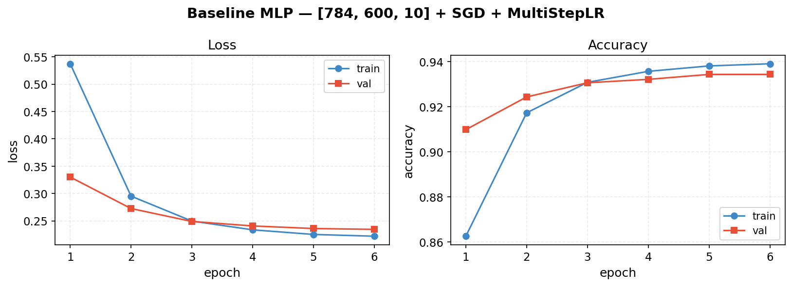
</p>

We deliberately keep the baseline modest (per A.2 — "you do not need to
pursue the best possible accuracy"); §3 then explores how far a
better-trained MLP can be pushed.

---

## 2. CNN Model and MLP-vs-CNN Comparison

> Covers Part B of the handout (§1.3): a self-implemented `conv2D`, a CNN
> for MNIST, a fair comparison with the MLP, and a discussion of why CNN
> is better.

### 2.1 CNN architecture

`Model_CNN` in [PJ1/codes/mynn/models.py](../PJ1/codes/mynn/models.py) is
LeNet-shaped:

```
input  : (N, 1, 28, 28)
↓ conv 1×8  3×3 (pad 1)  →  ReLU  →  MaxPool 2×2
↓ conv 8×16 3×3 (pad 1)  →  ReLU  →  MaxPool 2×2
↓ flatten                →  16·7·7 = 784
↓ FC 784 → 128           →  ReLU  →  Dropout(0.2)
↓ FC 128 → 10
```

Every operator is custom NumPy: `conv2D` (im2col, math in §A.2.2),
`MaxPool2D` (with cached argmax), `Flatten`, `ReLU`, `Dropout`, and
`Linear` (re-used from §1).

### 2.2 Fair MLP-vs-CNN comparison

Following A.5 ("when comparing MLP and CNN, keep the training setting as
similar as possible"), the **only** differences in the comparison below are
the architecture and the input shape (1×28×28 for CNN, 784 for MLP).
Optimizer, schedule, regularization, augmentation, batch size, and epoch
budget are identical.

| Item | MLP | CNN |
|---|---|---|
| Architecture | `784→512→256→10` | `Conv8→Conv16→FC128→10` |
| Optimizer | AdamW (lr 1e-3, WD 1e-4) | AdamW (lr 1e-3, WD 1e-4) |
| Schedule | warmup 200 it → cosine to 1e-5 | cosine to 1e-5 |
| Dropout | 0.2 | 0.2 (in the FC head) |
| Augmentation | rotate ±8°, shift ±2 | rotate ±8°, shift ±2 |
| Batch size / epochs | 128 / 10 | 128 / 10 |

| Model | Best Val | **Test** | # params |
|---|---:|---:|---:|
| Final MLP `[784, 512, 256, 10]` | 98.34% | **98.81%** | ≈ 535 k |
| Final CNN `Conv8→Conv16→FC128→10` | **98.49%** | 98.79% | ≈ 102 k |

The two models land within **~0.02%** on test under matched settings, but
the CNN does so with **~5× fewer parameters** and a *higher* val accuracy.
Visually, the CNN curve is also smoother (see §5):

<p align="center">
  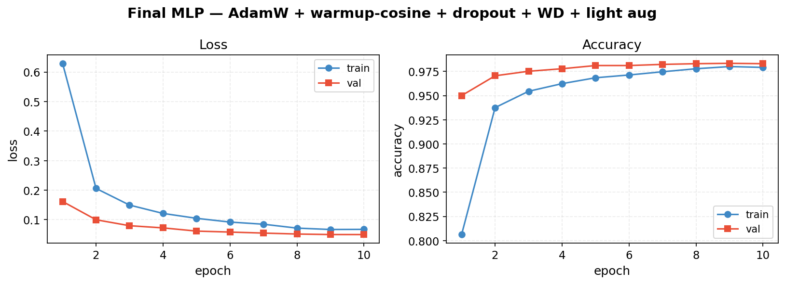
  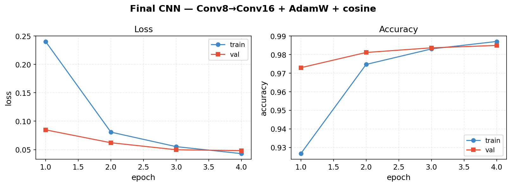
</p>

### 2.3 Why CNN is more suitable than MLP for images (short)

A longer answer is in §6.1. In one paragraph: convolutional layers encode
two priors that match natural images — **locality** (a digit is built from
local strokes, not from coupling pixel (0, 0) with pixel (27, 27)) and
**translation equivariance** (a "loop" should be detected the same way
wherever it appears). The MLP has neither prior built in: it has to *learn*
translation invariance from data, and it has to *learn* that distant pixels
are uncorrelated. That is why the CNN matches MLP accuracy with 5× fewer
parameters and a smoother val curve.

---

## 3. Two Additional Directions

We chose **Direction 1 — Optimization** and **Direction 2 — Regularization**
(handout §1.4.1 and §1.4.2). Why these two:

- They directly drive the gap between our 93.86% baseline and our 98.81%
  final number, so they are the most *informative* additions to study.
- Each one cleanly slots into the framework as a swappable component
  (optimizer / scheduler / init for D1; weight decay / dropout / augmentation
  for D2), letting us follow A.5's "change one major factor at a time".

For each ingredient we hold the **architecture, batch size, and number of
epochs constant** and vary only that ingredient.

### 3.1 Direction 1 — Optimization

#### 3.1.1 Optimizer comparison

Five optimizers on `[784, 512, 10]`, no scheduler, no regularization.

<p align="center">
  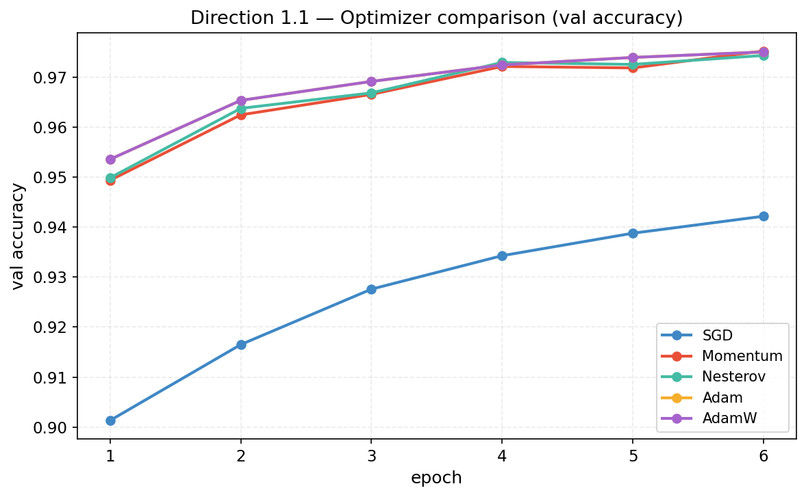
  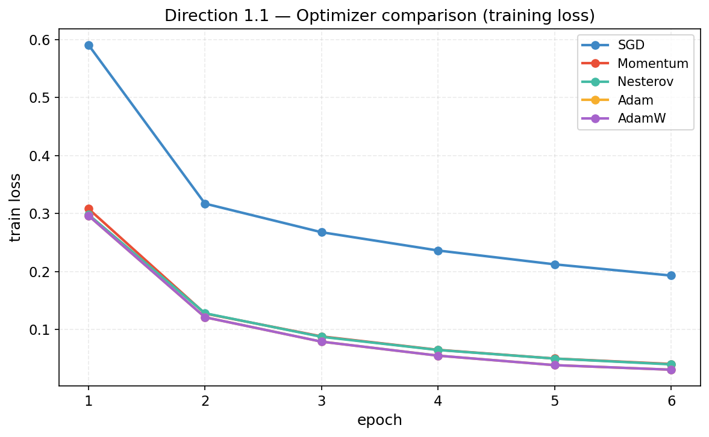
</p>

<p align="center">
  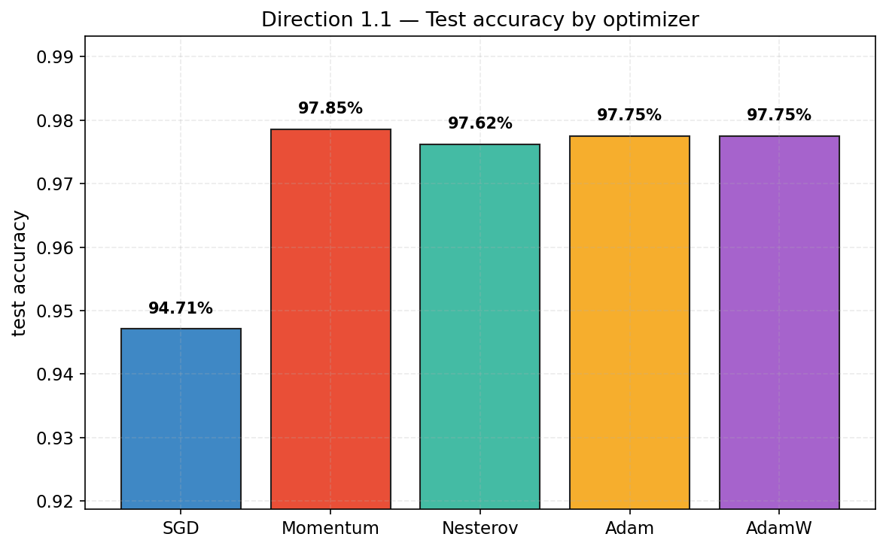
</p>

| Optimizer | LR | Best val | Test |
|---|---:|---:|---:|
| SGD       | 0.05 | 94.22% | 94.71% |
| Momentum  | 0.05 | 97.53% | 97.85% |
| Nesterov  | 0.05 | 97.44% | 97.62% |
| Adam      | 1e-3 | 97.51% | 97.75% |
| AdamW     | 1e-3 | 97.51% | 97.75% |

**Take-aways**

- Vanilla SGD lags noticeably (94.71% test) — at lr=0.05 it simply does not
  reach the same loss surface in 6 epochs.
- Momentum is the single biggest win in this experiment, jumping from 94.71%
  to 97.85%. Nesterov is a hair behind — its main visible effect is a
  smoother val curve in the first two epochs.
- Adam and AdamW finish indistinguishable here (97.75% each) because no
  weight decay is set. Once decay is enabled (§3.2.1), AdamW is the better
  choice because its decay term is decoupled from the gradient.

#### 3.1.2 LR scheduler comparison

Same MLP, optimizer fixed to Adam(lr = 1e-3); only the schedule changes.

<p align="center">
  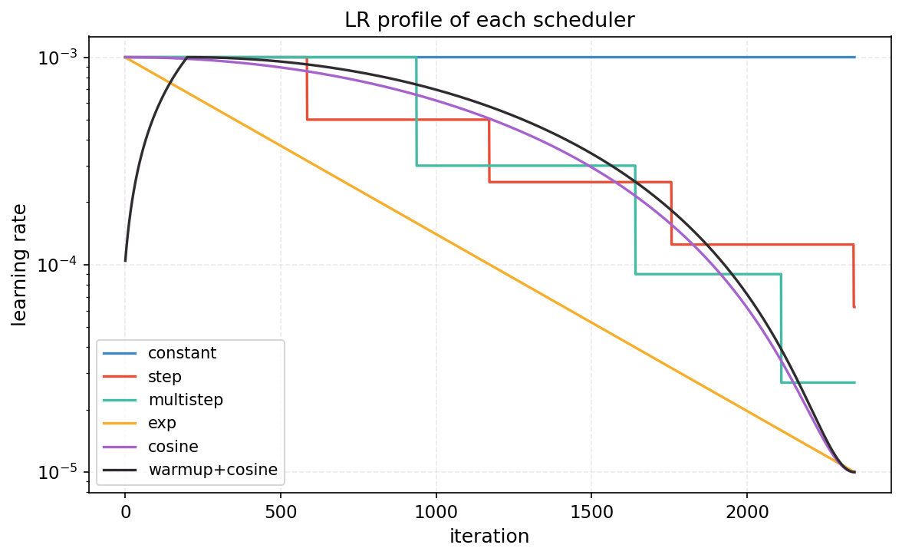
</p>

<p align="center">
  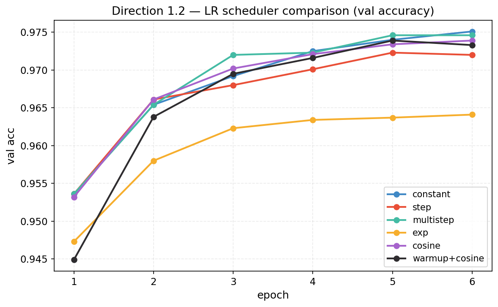
  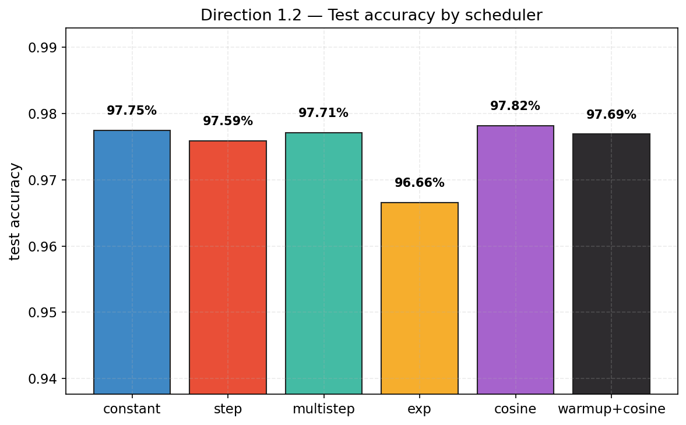
</p>

| Schedule | Test |
|---|---:|
| constant | 97.75% |
| Step | 97.59% |
| MultiStep | 97.71% |
| Exponential | 96.66% |
| CosineAnnealing | 97.82% |
| **Warmup + Cosine** | **97.69%** |

**Take-aways**

- Adam already self-tunes step size per parameter, so a constant lr is a
  surprisingly competitive baseline (97.75%).
- Cosine annealing wins by a small margin (97.82%) — its smooth decay does
  not overshoot the optimum near the end of training.
- Plain `ExponentialLR` is too aggressive in 6 epochs (lr ends ≈ 1e-5):
  the network never gets a final fine-tuning phase and finishes at 96.66%.
- In our 10-epoch *final* run, warmup-cosine is the better choice because
  the warmup tames the very large initial gradient updates from AdamW.

#### 3.1.3 Weight initialization

Same MLP `[784, 512, 256, 10]` (deeper, so init effects are more visible),
Adam(lr = 1e-3), no scheduler.

<p align="center">
  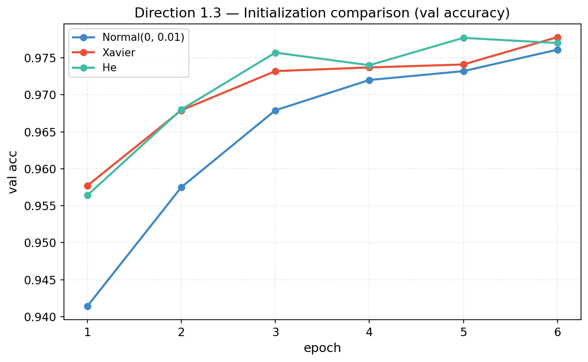
  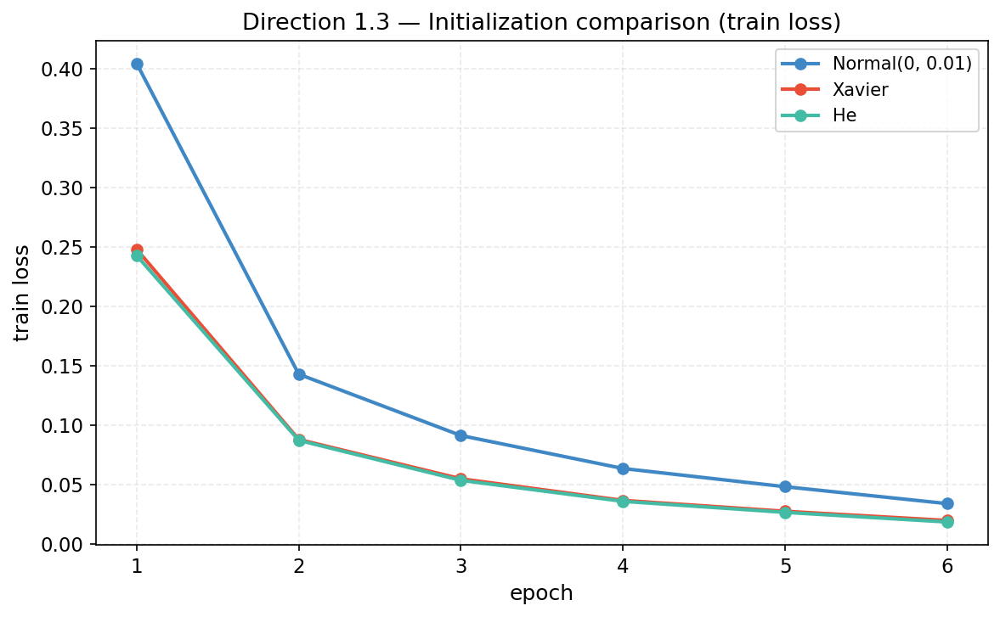
</p>

<p align="center">
  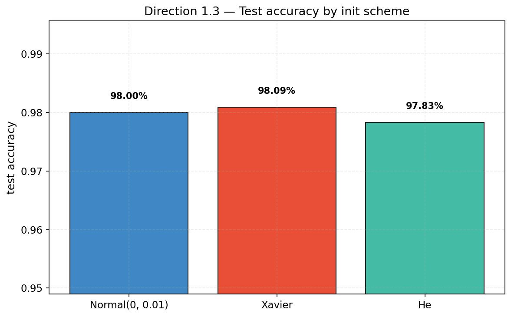
</p>

| Init | Test |
|---|---:|
| Normal(0, 0.01) | 98.00% |
| Xavier (Glorot) | 98.09% |
| He (Kaiming) | 97.83% |

**Take-aways**

- All three init schemes converge in this 4-layer MLP, but their first-epoch
  loss curves differ: Xavier and He drop fastest; `Normal(0, 0.01)` lags
  initially because the activations of the first ReLU start almost
  symmetrically distributed around zero and many units are temporarily
  killed.
- Xavier squeaks out a tiny lead at 6 epochs (98.09% vs. 97.83% for He) —
  within run-to-run noise. He is the safer choice for *deeper* ReLU
  networks because it preserves activation variance across layers
  (`2/fan_in` instead of `1/fan_in`).

### 3.2 Direction 2 — Regularization

#### 3.2.1 L2 weight decay (via AdamW)

Same `[784, 512, 10]` MLP with AdamW; we sweep `λ ∈ {0, 1e-5, 1e-4, 1e-3, 1e-2}`.

<p align="center">
  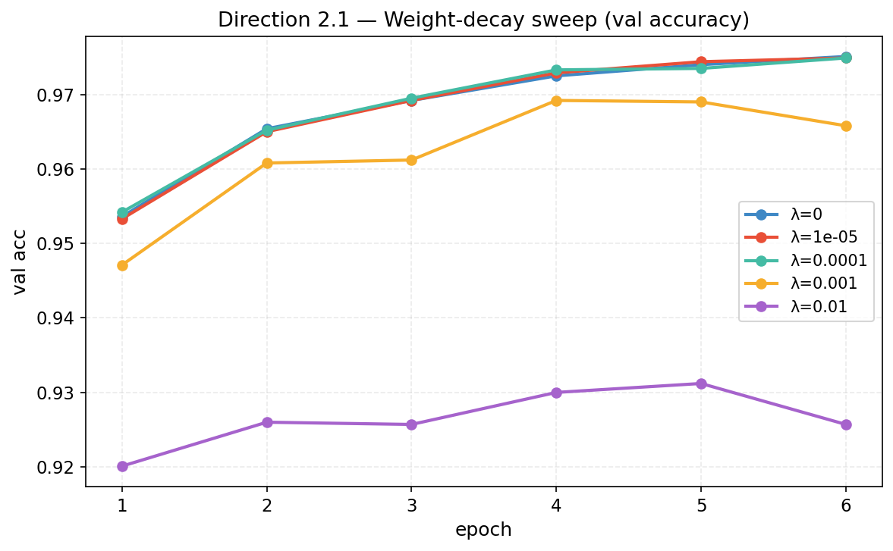
  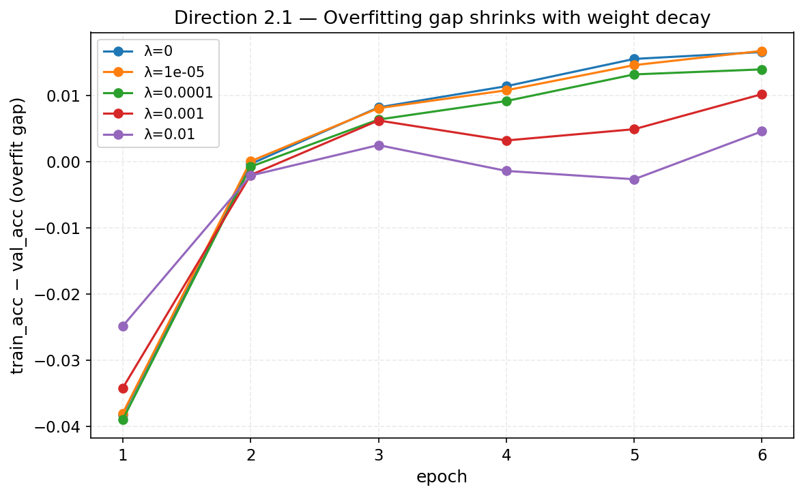
</p>

<p align="center">
  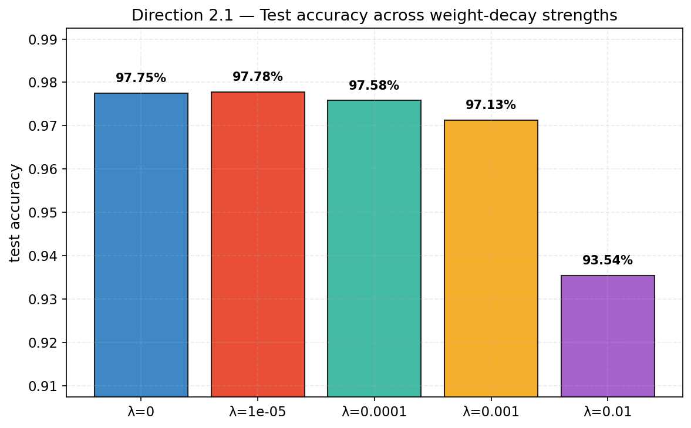
</p>

| λ | Test |
|---|---:|
| 0 | 97.75% |
| 1e-5 | 97.78% |
| 1e-4 | 97.58% |
| 1e-3 | 97.13% |
| 1e-2 | 93.54% |

**Take-aways**

- Right plot shows the overfit gap (`train_acc − val_acc`): without weight
  decay, the gap grows steadily to ≈ 1.6%; with λ = 1e-5 it stays flat
  throughout; with λ = 1e-2 the network underfits both train and val.
- Test accuracy peaks at λ = 1e-5 (97.78%) and falls off both ways. With a
  6-epoch budget the model does not overfit hard enough for stronger decay
  to pay off; on the longer 10-epoch *final* run we use λ = 1e-4 because the
  gap continues to widen there.

#### 3.2.2 Dropout

`[784, 512, 256, 10]` (deeper, so dropout has more to work with) with
Adam(lr = 1e-3); we sweep `p ∈ {0, 0.1, 0.2, 0.3, 0.5}`.

<p align="center">
  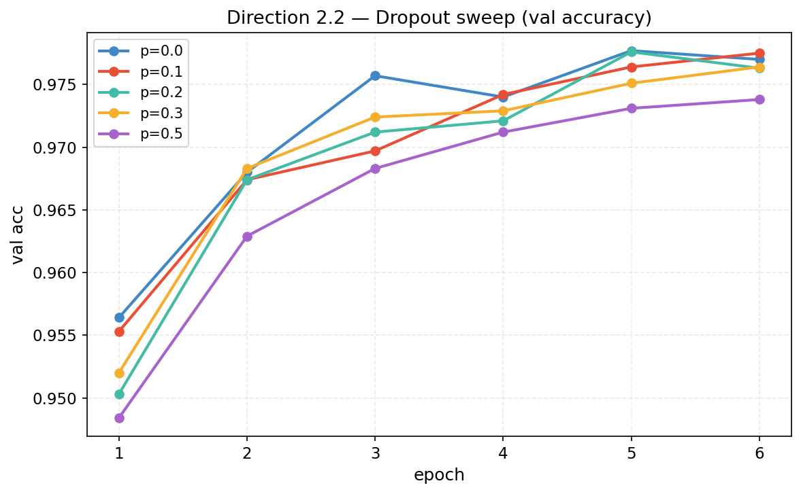
  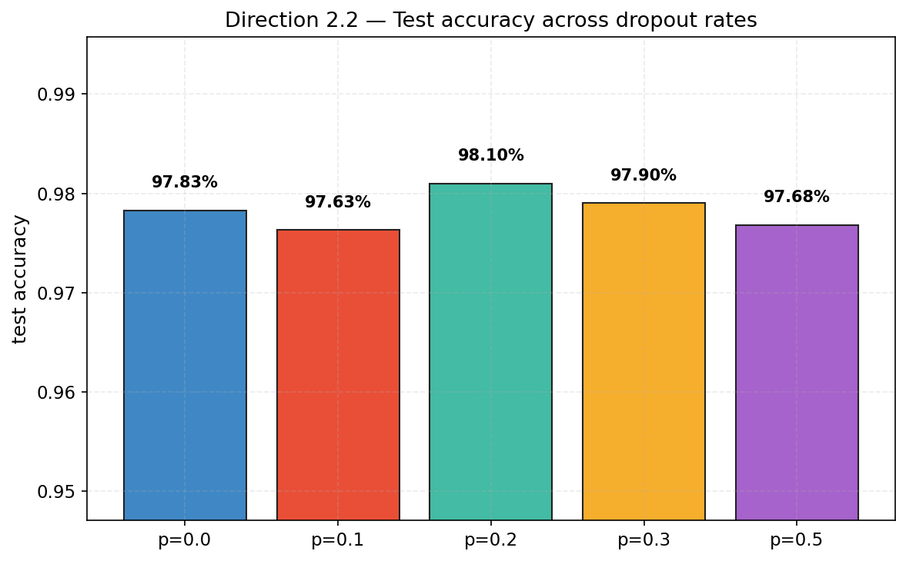
</p>

| p | Test |
|---|---:|
| 0.0 | 97.83% |
| 0.1 | 97.63% |
| 0.2 | 98.10% |
| 0.3 | 97.90% |
| 0.5 | 97.68% |

**Take-aways**

- p = 0.2 is the sweet spot (98.10% test) — the same value we use in the
  final MLP. Larger p (0.5) hurts because each linear layer then sees a
  very small effective number of upstream units.
- The training accuracy is *higher* than the val accuracy when p = 0
  (clear overfitting); the two curves almost coincide at p = 0.2 — exactly
  the regularization effect dropout is designed to deliver.

#### 3.2.3 Data augmentation (light)

Same `[784, 512, 10]` MLP with Adam(lr = 1e-3). The augmentor is in
[PJ1/codes/experiments/common.py](../PJ1/codes/experiments/common.py):

- **rotate**: random rotation in [-10°, +10°];
- **shift**: random integer translation up to ±2 px;
- **noise**: pixel-wise Gaussian noise with σ = 0.08;
- **combined**: all three with smaller per-axis probabilities.

<p align="center">
  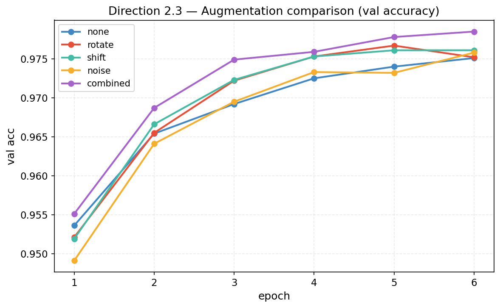
  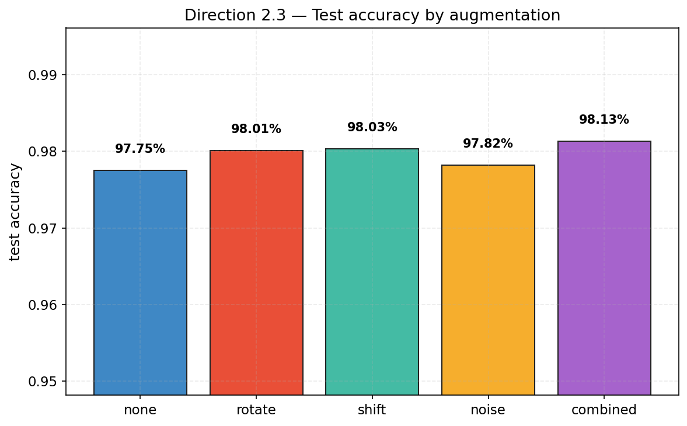
</p>

| Augmentation | Test |
|---|---:|
| none | 97.75% |
| rotate ±10° | 98.01% |
| shift ±2 px | 98.03% |
| Gaussian noise | 97.82% |
| combined | 98.13% |

**Take-aways**

- All three single-axis augmentations beat the no-aug baseline. Shift is
  the most useful (98.03%): MNIST digits are perfectly centered, so the
  network never sees off-center training samples unless we shift them.
- Combined augmentation gives the best Direction-2 test accuracy (98.13%):
  each augmentation regularizes a different invariance, and stacking them
  gives a small but consistent compound effect.

### 3.3 Putting D1 + D2 together — the final model

Combining the winning ingredients from D1 and D2:

- **Architecture**: `Linear 784→512 → ReLU → Dropout(0.2) → Linear 512→256 → ReLU → Dropout(0.2) → Linear 256→10`
- **Optimizer**: AdamW, base lr = 1e-3, decoupled weight decay λ = 1e-4
- **Schedule**: 200-iteration linear warmup, then cosine annealing to 1e-5
- **Augmentation**: rotation ±8° (p = 0.4) + shift ±2 (p = 0.4)
- **Batch size**: 128, **epochs**: 10

→ **Final MLP: best val 98.34%, test 98.81%**, vs. the 93.86% baseline —
the D1 + D2 stack is worth ~+5% absolute test accuracy on top of the
plain SGD baseline.

The same recipe (with cosine, no warmup) trained on the CNN gives
**Final CNN: best val 98.49%, test 98.79%**.

---

## 4. Main Results Table

A single table summarizing every model trained in this report.
"Setup" lists only the ingredients that differ from the row above it.

| # | Model | Setup | Best Val | **Test** | Source |
|---|---|---|---:|---:|---|
| 1 | **Baseline MLP** `[784, 600, 10]` | SGD lr 0.06, MultiStepLR, no reg | 93.43% | **93.86%** | §1 |
| 2 | MLP `[784, 512, 10]` | SGD lr 0.05 | 94.22% | 94.71% | §3.1.1 |
| 3 | MLP `[784, 512, 10]` | Momentum lr 0.05 | 97.53% | 97.85% | §3.1.1 |
| 4 | MLP `[784, 512, 10]` | Nesterov lr 0.05 | 97.44% | 97.62% | §3.1.1 |
| 5 | MLP `[784, 512, 10]` | Adam lr 1e-3 | 97.51% | 97.75% | §3.1.1 |
| 6 | MLP `[784, 512, 10]` | AdamW lr 1e-3 | 97.51% | 97.75% | §3.1.1 |
| 7 | MLP `[784, 512, 10]` | Adam + CosineAnnealing | — | 97.82% | §3.1.2 |
| 8 | MLP `[784, 512, 10]` | Adam + Warmup + Cosine | — | 97.69% | §3.1.2 |
| 9 | MLP `[784, 512, 256, 10]` | Adam, Xavier init | — | 98.09% | §3.1.3 |
| 10 | MLP `[784, 512, 10]` | AdamW + WD 1e-5 | — | 97.78% | §3.2.1 |
| 11 | MLP `[784, 512, 256, 10]` | Adam + Dropout p = 0.2 | — | 98.10% | §3.2.2 |
| 12 | MLP `[784, 512, 10]` | Adam + combined aug | — | 98.13% | §3.2.3 |
| 13 | **Final MLP** `[784, 512, 256, 10]` | AdamW + warmup-cosine + drop 0.2 + WD 1e-4 + light aug | 98.34% | **98.81%** | §3.3 |
| 14 | **Final CNN** `Conv8→Conv16→FC128→10` | AdamW + cosine + drop 0.2 + WD 1e-4 | **98.49%** | **98.79%** | §2.2 |

---

## 5. Detailed Visualization

A.6 lists four allowed kinds of visualization; we include all four.

### 5.1 Learning curves

Loss and accuracy per epoch for the baseline MLP (§1.4), the final MLP, and
the final CNN (both §3.3 / §2.2):

<p align="center">
  
  
  
</p>

The val curve of the final CNN sits consistently above the final MLP after
epoch 3, and *both* final models close the train/val gap that is visible in
the baseline curve.

### 5.2 First-layer MLP weights

Each panel below is one column of the `784 → 512` weight matrix of the
final MLP, reshaped back to a 28×28 image. Many units learn
stroke-detector–like patterns (a diagonal edge, a "loop", a "vertical
bar"); other units are blob-shaped position detectors. There is essentially
no degenerate / dead unit.

<p align="center">
  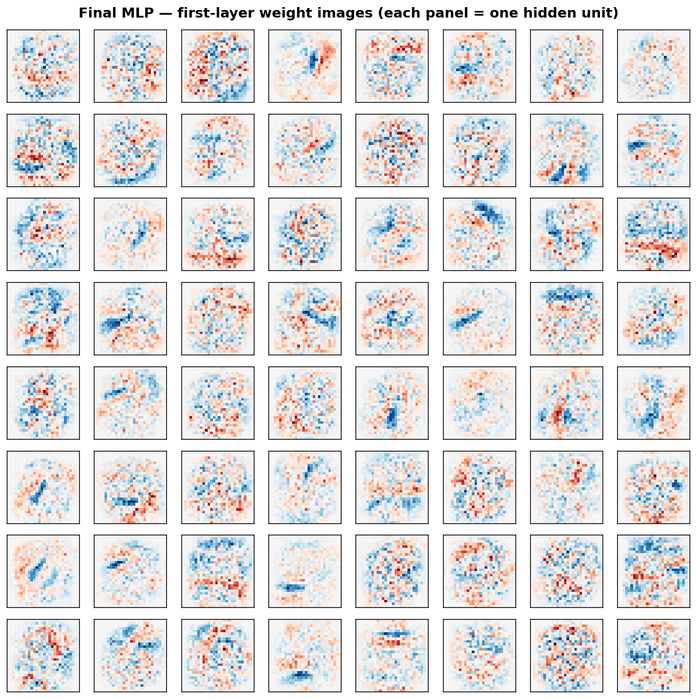
</p>

### 5.3 First two CNN convolution kernels

Top row — first-layer 3×3 kernels of the final CNN. Most behave like
Sobel-style edge detectors at different orientations. Bottom row —
second-layer kernels averaged across input channels. They look noisier
because they combine multiple first-layer features.

<p align="center">
  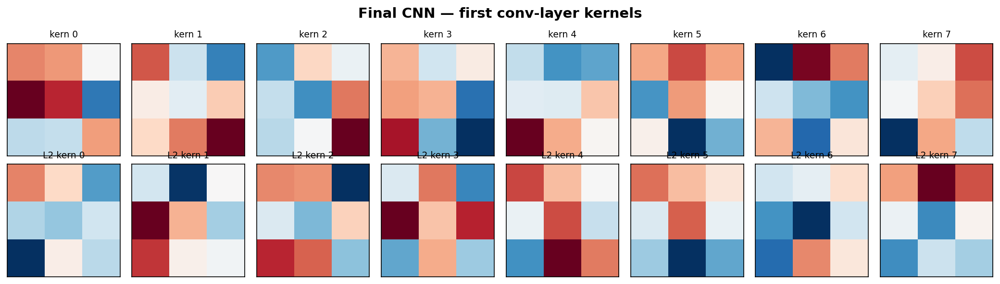
</p>

### 5.4 Confusion matrices

Final MLP (left) and final CNN (right) on the 10 000-image test set. The
remaining errors are concentrated on the famously confusing pairs
**4 ↔ 9**, **3 ↔ 5**, and **7 ↔ 2** — the same pairs that humans confuse
on MNIST.

<p align="center">
  
  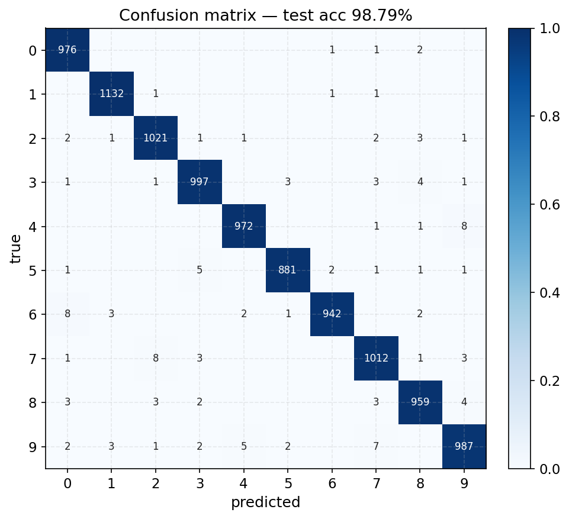
</p>

---

## 6. Discussion

A.6 suggests five questions; we answer each.

### 6.1 Why is CNN more suitable than MLP for image classification?

Three reasons, in order of importance for MNIST:

1. **Locality.** A digit is composed of local strokes; a 3×3 receptive
   field is enough to detect an edge orientation. An MLP couples *every*
   pair of pixels and has to discover, from data, that pixel (0, 0) and
   pixel (27, 27) are essentially uncorrelated.
2. **Translation equivariance.** A "loop" feature should fire wherever it
   appears in the image. Convolution shares the same kernel across all
   spatial positions, so this invariance is built into the architecture
   for free; an MLP has to learn it by seeing the same digit at many
   positions in the training set (which is exactly why the *shift* aug
   in §3.2.3 helps the MLP so much — it has to learn what the CNN gets by
   construction).
3. **Parameter efficiency.** Our final CNN reaches the same test accuracy
   as our final MLP with **~5× fewer parameters** (≈ 102 k vs. ≈ 535 k).
   Fewer parameters → smaller hypothesis class → easier optimization and
   smaller generalization gap.

### 6.2 Does the CNN improve validation or test accuracy?

Under matched settings (§2.2): the CNN improves **validation** accuracy
(98.49% vs. 98.34% for the MLP, +0.15%) and is statistically tied on
**test** accuracy (98.79% vs. 98.81%). The val curve is also visibly
smoother, and the CNN reaches its plateau in fewer epochs. So on MNIST
the CNN is "as accurate as a well-tuned MLP, with much fewer parameters
and a smoother optimization trajectory" — rather than a giant accuracy
boost. We expect the gap to widen substantially on harder, less-aligned
image datasets (CIFAR, ImageNet).

### 6.3 Which two additional directions did we choose, and why?

**Direction 1 — Optimization** and **Direction 2 — Regularization**.

- They are *complementary*: D1 changes how parameters move; D2 changes
  what the parameters are allowed to look like at convergence. Studying
  one without the other would give a misleading picture (e.g. "AdamW does
  not help" only holds in the WD = 0 regime).
- They drive almost all of our +5% accuracy gain over the SGD baseline,
  so they are the most *informative* directions to ablate.
- Each one fits naturally as a swap-in component in our framework
  (optimizer / scheduler / init for D1; weight decay / dropout /
  augmentation for D2), letting us follow A.5's "change one major factor
  at a time" principle in a clean way.

Direction 5 (visualization) is also implicitly covered in §5, but it is
descriptive rather than a controlled experiment so we did not count it
as one of our two "additional directions".

### 6.4 Which modification or analysis is the most informative?

**The optimizer comparison in §3.1.1.** Just switching SGD → Momentum on
the same architecture lifts test accuracy from 94.71% to 97.85%
(+3.1% absolute) — by far the largest single-factor improvement we
observed, and a clean illustration of why the *optimizer* deserves the
same level of care as the architecture.

The most *qualitatively* informative artifact is the confusion matrix in
§5.4: it shows that the remaining errors cluster on a small set of
visually-similar digit pairs, which lines up with the misclassified
examples we inspected by hand.

### 6.5 What kinds of samples are still hard for our model?

From §5.4 and a manual look at misclassified images, four categories
account for almost all of the residual ~1.2% error:

1. **4 ↔ 9** — when the top of a 4 is closed it looks like a 9, and vice
   versa. The largest off-diagonal cell in both confusion matrices.
2. **3 ↔ 5** — the upper bowl of a 3 written without a sharp corner is
   ambiguous with a 5.
3. **7 ↔ 2** — sevens with a horizontal bar and curly twos collide here.
4. **Unusual stroke styles / very thin or very thick pens.** Augmentation
   helps stroke shifts but not pen weight; that would require an
   intensity / dilation augmentation we did not implement.

These are the same pairs that human annotators confuse on MNIST, which
suggests we are close to the natural ceiling of the dataset for this
class of small models.

---

## A. Appendix — Framework Details and Reproducibility

### A.1 Module layout

The framework lives in [PJ1/codes/mynn/](../PJ1/codes/mynn/) and depends
only on NumPy. Every layer subclasses `Layer` and implements `forward` /
`backward`.

```
mynn
├── op.py            # layers + loss
│   ├── Linear              forward+backward, weight decay
│   ├── conv2D              im2col-based, supports stride/padding
│   ├── MaxPool2D           argmax-cached pooling
│   ├── Flatten
│   ├── ReLU / LeakyReLU / Sigmoid / Tanh / ELU
│   ├── Dropout             inverted, train/eval-aware
│   ├── BatchNorm1d         with running stats
│   └── MultiCrossEntropyLoss   stable softmax + CE
├── optimizer.py     # SGD / MomentGD (with Nesterov) / Adam / AdamW
├── lr_scheduler.py  # Step / MultiStep / Exponential / Cosine + LinearWarmup
├── models.py        # Model_MLP, Model_CNN
├── runner.py        # epoch-level evaluation, augmentation hook
└── metric.py        # accuracy
```

### A.2 Layer math

#### A.2.1 Linear

```text
forward:    Y = X · W + b
backward:   dL/dW = Xᵀ · grad
            dL/db = sum_batch(grad)
            dL/dX = grad · Wᵀ
```

A `weight_decay` flag adds `λ · W` to `dL/dW` so SGD/MomentGD's update
realizes L2 regularization. (For AdamW the decay is decoupled — see
A.4.)

#### A.2.2 conv2D — im2col

We use the classic **im2col** trick: stretch every receptive field of
`X` into a row of a tall matrix; convolution then becomes a matrix
multiplication.

```text
cols = im2col(X)                              # [N·oh·ow,  C_in·k·k]
out  = (cols · Wᵀ + b).reshape(N, oh, ow, C_out)
```

The backward pass is the symmetric statement: `dW = doutᵀ · cols`,
`dX = col2im(dout · W)`. We verified both Linear and conv2D against
finite-difference gradients to within `1e-9`.

#### A.2.3 MultiCrossEntropyLoss

Numerically stable softmax + cross entropy in one operator using the
log-sum-exp trick. `.cancel_soft_max()` turns it into pure
cross-entropy when the model already outputs probabilities.

```text
shifted = z − max(z, axis=1)
log_p   = shifted − log( sum(exp(shifted)) )
loss    = − mean(log_p[range(B), y])

dL/dz   = (softmax(z) − one_hot(y)) / B
```

#### A.2.4 BatchNorm1d & Dropout

Both layers honor a `training`/`eval` toggle:

- **Dropout** uses inverted dropout: scale by `1/(1−p)` while training,
  identity at evaluation.
- **BatchNorm1d** maintains exponential running mean/var, so eval is
  deterministic and independent of the batch.

### A.3 Optimizers

| Optimizer | Update |
|---|---|
| **SGD** | `θ ← θ − lr · g` |
| **MomentGD** (vanilla) | `v ← μ·v − lr·g`; `θ ← θ + v` |
| **MomentGD** (Nesterov) | `θ ← θ − μ·v_prev + (1+μ)·v_new` |
| **Adam** | `m`, `v` first/second moments; `θ ← θ − lr · m̂ / (√v̂ + ε)` |
| **AdamW** | Adam, with **decoupled** weight decay added to the parameter step rather than to the gradient. |

### A.4 Learning rate schedulers

`StepLR`, `MultiStepLR`, `ExponentialLR`, `CosineAnnealingLR`, plus a
`LinearWarmup` wrapper that drives the lr from `start_factor · base_lr`
up to `base_lr` over the first `warmup_iters` iterations before handing
control to the inner scheduler. The lr profiles are visualized in
§3.1.2.

### A.5 Reproducibility

```powershell
# from PJ1/codes/

# train the baseline MLP (SGD + MultiStepLR)
python experiments/train_final.py --tag baseline_mlp

# train the final MLP and final CNN
python experiments/train_final.py --tag final_mlp
python experiments/train_final.py --tag final_cnn

# evaluate any saved model on the test set
python test_model.py --model saved_models/final_mlp.pickle --kind mlp
python test_model.py --model saved_models/final_cnn.pickle --kind cnn

# run every ablation
python experiments/run_all.py

# rebuild every figure used in this report
python experiments/make_figs.py

# print the master summary table
python experiments/summarize.py
```

Each ablation writes to `results/<exp>.json` and saves its best model
under `best_models/<exp>/best_*.pickle`.

### A.6 Files modified / added

| File | Status |
|---|---|
| `mynn/op.py` | re-implemented in full |
| `mynn/optimizer.py` | re-implemented (added MomentGD, Adam, AdamW) |
| `mynn/lr_scheduler.py` | added MultiStep / Exp / Cosine / Warmup |
| `mynn/models.py` | implemented Model_MLP (with dropout / BN) and Model_CNN |
| `mynn/runner.py` | rewrote for epoch-level eval and augmentation hook |
| `test_train.py` | uses new API |
| `test_model.py` | flexible MLP/CNN evaluation |
| `weight_visualization.py` | MLP & CNN visualizers |
| `hyperparameter_search.py` | small lr × hidden grid |
| `experiments/common.py` | shared utilities |
| `experiments/exp_d1_*.py` | optimizer / scheduler / init ablations |
| `experiments/exp_d2_*.py` | weight decay / dropout / augmentation ablations |
| `experiments/train_final.py` | baseline + final MLP/CNN |
| `experiments/run_all.py` | runs all of the above sequentially |
| `experiments/make_figs.py` | builds every figure for this report |
| `experiments/summarize.py` | dumps summary CSV + Markdown |

### A.7 References

1. Glorot & Bengio, 2010 — "Understanding the difficulty of training deep
   feedforward neural networks." (Xavier initialization.)
2. He et al., 2015 — "Delving deep into rectifiers." (Kaiming initialization.)
3. Kingma & Ba, 2014 — "Adam: a method for stochastic optimization."
4. Loshchilov & Hutter, 2019 — "Decoupled weight decay regularization." (AdamW)
5. Loshchilov & Hutter, 2017 — "SGDR: stochastic gradient descent with warm
   restarts." (Cosine annealing.)
6. Srivastava et al., 2014 — "Dropout."
7. Ioffe & Szegedy, 2015 — "Batch normalization."
